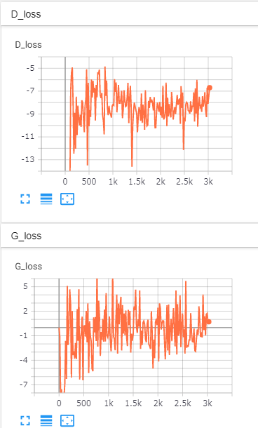

#  wavegan clone   

This is cloned from  [chrisdonahue/wavegan](https://github.com/chrisdonahue/wavegan) to learn GAN synthesize.  

## experiment  

This is an expermental script to test wavegan on google colaboratory.   
[wavegan_colab_practice1_sc09.ipynb](https://colab.research.google.com/github/shun60s/wavegan-clone/blob/master/wavegan_colab_practice1_sc09.ipynb)  

Following is 6 hours train result using sc09 (digits speech).  
D-loss G-loss (until 3k)  
  
  
There are generated wave samples in model.ckp-2995-generated-wave-sample folder.  
Their sound quality is sill low, due to train time is short.  
  
  
  

## License  

Regarding to original wavegan license, please see LICENSE-wavegan.txt.  

